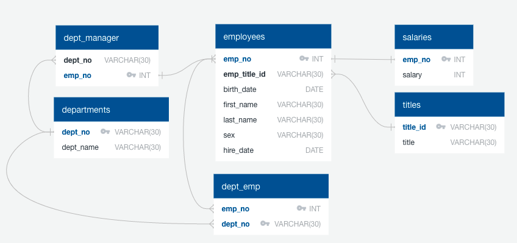

# Employee Database

Homework for Boot Camp Week 9: SQL; Submitted by Corey Lawson-Enos

## Summary
* employees Database: Created in SQL, includes tables for tracking employee data: name, birth date, sex, hire date, salary, department, title.

## Technologies
SQL (pgAdmin), Matplotlib, Pandas, Jupyter Notebook

## Entity Relationship Diagram (ERD)

## Additional Analysis
* Latitude did not show significant relationship to Humidity, Cloudiness, and Wind Speed categories. Sample humidity plot: 

* Although northern latitude change shows a strong link to temperature, the tie is much weaker in the South; as such, it cannot be construed from the dataset generated that latitude is the only contributing factor to global temperature variance.

* Interactive Google Map displays VacationPy's plotted cities colored by humidity level:

